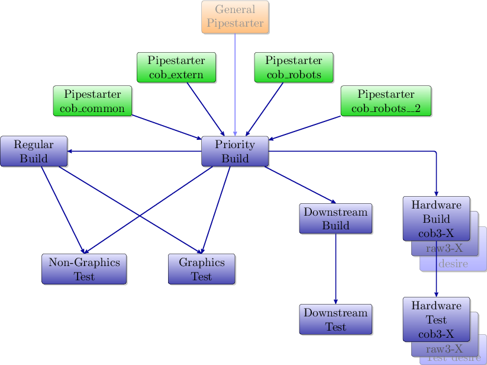
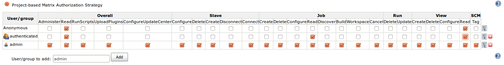
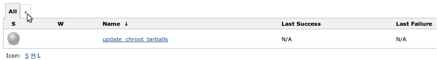
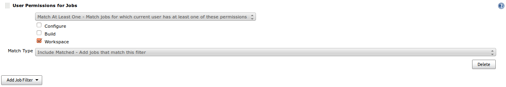

# Jenkins Guide (DETAILED)

This repository contains the code (config, src and script files) to set up and run a Cob-[Jenkins CI server](http://jenkins-ci.org) using the [Cob-Pipeline-Plugin](http://github.com/ipa320/cob-pipeline-plugin).

This guide is designed for Cob-Pipeline developers, those who want to setup a efficient test framework and those who just want to know more about it.
**If you want to set up the Cob-Pipeline quickly on one computer and only use it, the [minimal Jenkins Guide](README.md) is what you are looking for.**
Below you will find a detailed description of the purposes of the Cob-Pipeline and the setup for **one master** and **multiple slave** nodes.
Nevertheless, reading the short description of the setup process in the [minimal Jenkins Guide](README.md) first may help to understand the whole system better.

###Version
The plugin and this manual are designed and tested for Jenkins CI v1.514.

###Table of Contents
* [Software Structure](#software-structure)
* [Pipeline Structure](#pipeline-structure)
    * [Job Types](#job-types)
* [Jenkins Installation](#jenkins-installation)
    * [Debian Packages](#debian-packages-for-ubuntu)
    * [Up-/Downgrade to v1.514](#up-or-downgrade-jenkins-to-version-v1514)
* [Jenkins Configuration](#jenkins-configuration)
    * [Configure Security](#configure-security)
    * [Basic Configuration](#basic-configuration)
    * [Install the cob-pipeline plugin](#install-the-cob-pipeline-plugin)
    * [Install `jenkins_setup` & `jenkins_config`](#install-jenkins_setup--jenkins_config)
    * [Configure the cob-pipeline plugin](#configure-the-cob-pipeline-plugin)
    * [Jenkins Plugin Installation](#jenkins-plugin-installation)
    * [Setup maintenance jobs and default view](#setup-maintenance-jobs-and-default-view)
* [Tarball Server](#tarball-server)
* [Slaves](#slaves)
    * [Configure the build slave/node](#configure-a-build-slavenode)
    * [Configure the hardware slave/node](#configure-a-hardware-slavenode)
    * [Create a new slave node in Jenkins](#create-a-new-slave-node-in-jenkins-slave-setup-on-master)
* [DEVELOPERS GUIDE](#developers-guide)
    * [Workflow](#workflow)
    * [Development Use-Cases](#development-use-cases)
* [Manual Pipeline Generation (deprecated)](#manual-pipeline-generation-deprecated)


##Software Structure

For the usage of the Cob-Pipeline three parts are necessary:
* [Cob-Pipeline-Plugin](https://github.com/ipa320/cob-pipeline-plugin) for Jenkins<br/>
    This plugin allows the user to configure its individual build/test
    pipeline via the Jenkins web interface. Afterwards the automatic generation
    of the pipeline can be triggered.
* [jenkins\_setup repository](https://github.com/ipa320/jenkins_setup)<br/>
    This repository has to be available on the Jenkins server. It
    includes the code for the pipeline generation.
* [jenkins\_config repository](https://github.com/ipa320/jenkins_config_example)<br>
    In this repository all the pipeline configurations are stored.


##Pipeline Structure

The pipeline is made of multiple, differing Jenkins jobs which monitor the source code and build or test it in various envirements.
An authorized Jenkins user can configure its individual pipeline in its Jenkins user configurations.
The made configurations have to pass a validation and afterwards the automatic generation of the pipeline can be started.

A fully configured pipeline has always the structure shown in the picture below.


All build and test processes take place in [`chroot`s](http://help.ubuntu.com/community/BasicChroot) to garanty a clean and controlled environment.

###Job Types
####Starter Jobs
* **Pipestarter Job**<br/>
    Every *Pipestarter Job* polls one GitHub repository for source code changes.
    When a change is detected the *Priority-Build Job* gets triggered for the corresponding repository.

####Build Jobs
* **Priority-Build Job**<br/>
    The *Priority-Build Job* is the first real job in every pipeline.
    First of all it gets the corresponding `chroot` tarball depending on the environment to build the repository for.
    After entering the `chroot` the actual build process starts.
    * Clone the lastest version of the repository
    * Calculate its dependencies and install them
    * `make` the  repository and its dependencies.<br/>
    At the end the `chroot` gets closed, archived in the tarball and uploaded to the tarball server.

* **Regular-Build Job**<br/>
    This job does the same as the *Priority-Build Job* but for further environments.

* **Downstream-Build Job**<br/>
    In contrast to the two previous build jobs the *Downstream-Build Job* builds all the ROS-packages that depend directly on the configured repository.

####Test Jobs
The following jobs run the tests given in the repository.
First of all the `chroot` tarball, created by the before executed *Build Job*, is downloaded.
The tests are executed inside this chroot.
* **Non-Graphics-Test Job**<br/>
    This job does only support tests which require no graphics support.
* **Graphics-Test Job**<br/>
    If graphics are required for the tests this job is the right one.

####Hardware Jobs
* **Hardware-Build Job**<br/>
    This job builds the code again on the selected hardware/robot.
    The environment (Ubuntu version, system architecture) is given by the hardware.

* **Hardware-Test Job**<br/>
    After a successful build the repository will closingly be tested on the hardware.


## Jenkins Installation

### Debian packages for Ubuntu
Install basic packages

```bash
sudo apt-get install git-core pbuilder devscripts pigz python-jenkins
```

Install basic ROS packages

```bash
sudo sh -c 'echo "deb http://packages.ros.org/ros/ubuntu precise main" > /etc/apt/sources.list.d/ros-latest.list'
wget http://packages.ros.org/ros.key -O - | sudo apt-key add -
sudo apt-get update && sudo apt-get install ros-groovy-ros
```

Add the jenkins debian repository and install jenkins

```bash
wget -q -O - http://pkg.jenkins-ci.org/debian/jenkins-ci.org.key | sudo apt-key add -
sudo su -c 'echo "deb http://pkg.jenkins-ci.org/debian binary/" > /etc/apt/sources.list.d/jenkins.list'
sudo apt-get update && sudo apt-get install jenkins
```

Install `apt-cacher`

During the later build process a lot packages will be installed.
If the build jobs run frequently, the network traffic increases quite much.
To limit the amount of packages to be downloaded from the internet and speed up the installation process a apt-cacher is pretty useful.
You can for example use the [apt-cacher-ng](http://www.unix-ag.uni-kl.de/~bloch/acng/).

```bash
sudo apt-get install apt-cacher-ng
```

To use the apt-cacher during the build process it has to be set as proxy in the `chroot`.
Therefore you have to add the address as parameter in the update\_chroot\_tarballs job.
See how you can do this [here](#configure-update_chroot_tarballs-job).

> You can also use the apt-cacher of pbuilder.
> Then you should **NOT** do [this](#dont-use-pbuilders-aptcache).


### Up or downgrade jenkins to version v1.514
This guide and the Jenkins plugin are designed for Jenkins v1.514.
You can find the war file [here](http://mirrors.jenkins-ci.org/war).

```bash
cd /usr/share/jenkins/
sudo rm -rf jenkins.war
sudo wget http://mirrors.jenkins-ci.org/war/1.514/jenkins.war
```

restart jenkins

```bash
sudo /etc/init.d/jenkins restart
```

> *!!! In general: Be careful with updating your Jenkins server. If you
> do, check if everything still works properly, especially the plugins!!!*

After a successful installation you can access the jenkins server in your browser at [http://localhost:8080](http://localhost:8080).


## Jenkins configuration
To manage your Jenkins server, go to [http://localhost:8080/manage](http://localhost:8080/manage) or follow "Manage Jenkins" in the sidebar.
There you can configure everything.

###Configure Security
There are multiple ways to configure the global security of your Jenkins server.
First of all go to [**Configure Global Security**](http://localhost:8080/configureSecurity) and check *Enable Security*.

####Security Realm
The **Access Control** section gives the opportunity to select the **Security Realm** which defines how the users can login.

* **Jenkins's own user database**<br/>
    The easiest way is to use *Jenkins's own user database*.
    This option should always be available and possible.
    Now you can decide if every user can sign up (*Allow users to sign up*) or if the admin has to do this.

    If you use this, you have to create an user before you go on.
    This user will later on act as the admin user.
    Therefore save the configurations and **sign up** (upper right corner).
    Came back afterwards.

> * **Github Authentication Plugin**<br/>
>   Another way is to use the GitHub user database for user identification.
>   The [Github OAuth Plugin](#install-required-jenkins-plugins) has to be installed.
>   Configure the plugin as described
>   [here](https://wiki.jenkins-ci.org/display/JENKINS/Github+OAuth+Plugin) for an 'omnipotent' GitHub user.

> * **LDAP**<br/>
>   If a LDAP server is available, you can use it as the user database.
>   Therefore the [LDAP Plugin](#install-required-jenkins-plugins) is required.
>   How to configure the LDAP access can be found on the [plugin's website](https://wiki.jenkins-ci.org/display/JENKINS/LDAP+Plugin).
>   An example is given [here](pictures/LDAP_config.png).


####Authorization
In the **Authorization** subsection you can define the permission a specific user or a user group gets granted.
Therefore choose the 'Project-based Matrix Authorization Strategy'.

You have to give permissions to at least the *Anonymous* and the *authenticated* user group and an *admin* user.
The latter two have to be added to the matrix.

> **If you use [Jenkins's own user database](#jenkin's-own-user-database) the admin user you just created can be used.
> If one of the other [Security Realms](#security-realm) is used, take an existing user as admin.**

**The *admin* should have all rights.**
Otherwise you will [lock out yourself](https://wiki.jenkins-ci.org/display/JENKINS/Disable+security).
This account will also be used to create the pipeline jobs automatically.
The users and groups could get the permissions as shown below.


Every user will automatically get the permission to see the workspace of all its own jobs.
For the 'Pipestarter' and 'Trigger' job it will also has 'Build'-permission.
> If you want to grant further permissions or give special permissions to individual users or user groups you can do it here.


### Basic configuration
The basic configurations of your Jenkins server are described in the [short Jenkins Guide](README.md#basic-configuration)


### Install the *cob-pipeline* plugin
Download the plugin (\*.hpi file) from [https://github.com/ipa320/cob-pipeline-plugin/tree/master/releases](https://github.com/ipa320/cob-pipeline-plugin/tree/master/releases) ([latest](https://github.com/ipa320/cob-pipeline-plugin/raw/master/releases/v0.9.6/cob-pipeline.hpi)), place it in `/var/lib/jenkins/plugins` and restart Jenkins.

    cd /var/lib/jenkins/plugins
    sudo wget https://github.com/ipa320/cob-pipeline-plugin/raw/master/releases/v0.9.6/cob-pipeline.hpi
    sudo /etc/init.d/jenkins restart

Afterwards the plugin should be available and the **Pipeline Configuration** link should be present in the sidebar (see picture).


Configure Jenkins as described below before you use the plugin.

### Install `jenkins_setup` & `jenkins_config`

> We assume that you work with an admin user account named 'jenkins'

All scripts and configurations will be stored in `/home/jenkins/jenkins-config`.

```bash
mkdir ~/jenkins-config
```

Setup ssh configuration (create ssh-key if it doesn't exist already and add github.com and localhost to known hosts).

```bash
ssh-keygen
touch ~/.ssh/known_hosts
ssh-keyscan -H github.com >> ~/.ssh/known_hosts
ssh-keyscan -H localhost >> ~/.ssh/known_hosts
```

You have to add this key to your GitHub 'omnipotent' user [http://github.com/settings/ssh](http://github.com/settings/ssh).

```bash
cat ~/.ssh/id_rsa.pub
```

Setup git configuration on master.

```bash
git config --global user.name "<USER_NAME>"
git config --global user.email "<EMAIL>"
```

Clone the `jenkins_setup` and `jenkins_config` repositories.

*You have to create a repository named 'jenkins_config'.*
The easiest way is to fork [https://github.com/ipa320/jenkins_config_example](https://github.com/ipa320/jenkins_config_example) and rename it to `jenkins_config`.

> It is also recommended to clone the
> [jenkins_setup](https://github.com/ipa320/jenkins_setup) repository to
> keep track of changes and updates.

```bash
git clone git@github.com:<GITHUB_USER>/jenkins_config.git ~/jenkins-config/jenkins_config
git clone git@github.com:<GITHUB_USER>/jenkins_setup.git ~/jenkins-config/jenkins_setup
```

Add the `jenkins_setup` module to the `$PYTHONPATH` (adapt the *ROS_RELEASE*).

```bash
sudo su -c 'echo "export PYTHONPATH=~/jenkins-config/jenkins_setup/src" > /etc/profile.d/python_path.sh'
sudo su -c 'echo "source /opt/ros/groovy/setup.sh" >> /etc/profile.d/python_path.sh'
```

Enable passwordless sudo rights for the jenkins user by adding the following line at the end of `/etc/sudoers` (open with `sudo visudo -f /etc/sudoers`).

```bash
jenkins    ALL=(ALL) NOPASSWD: ALL
```

Afterwards reboot the Jenkins-Server

```bash
sudo reboot now
```


### [Configure the cob-pipeline plugin](README.md#configure-the-cob-pipeline-plugin)
How to configure the cob-pipeline plugin is described [here](README.md#configure-the-cob-pipeline-plugin).
You can follow this example.
Only **if you use the [Github Authentication Plugin](#security-realm) for authentication, enter the Jenkins Admin API token instead of its password.**
To get the API token go to the [admins user configuration](http://localhost:8080/me/configure).
It can be found in the section **API Token**. Press *Show API Token...*.


### Jenkins plugin installation
####Install required Jenkins plugins
Go to [Jenkins plugin manager](http://localhost:8080/pluginManager/available) and install the following plugins:
* **Git Plugin** ([website](https://wiki.jenkins-ci.org/display/JENKINS/Git+Plugin))<br/>
    Monitors the repositories to build and triggers pipeline when a change is detected.
* **Parameterized Trigger Plugin** ([website](http://wiki.jenkins-ci.org/display/JENKINS/Parameterized+Trigger+Plugin))<br/>
    Is used to transfer build parameters from one job to the next.
    Here it is used to commit the repository to build or test.
* **Build Pipeline Plugin** ([website](http://code.google.com/p/build-pipeline-plugin))<br/>
    Provides a view where all pipeline jobs and their dependencies are shown.
    It also gives the opportunity to trigger the hardware test jobs manually.
* **Mailer** ([website](http://wiki.jenkins-ci.org/display/JENKINS/Mailer))<br/>
    Generates the email content depending on the build/test results and sends the emails.
* **View Job Filters**
  ([website](http://wiki.jenkins-ci.org/display/JENKINS/View+Job+Filters))<br/>
    Provides comprehensive possibilities to filter the jobs that can
    be seen by the specific user.
* **Build-timeout Plugin** ([website](https://wiki.jenkins-ci.org/display/JENKINS/Build-timeout+Plugin))<br/>
    Aborts a job if it takes too long.

####Install supplementary Jenkins plugins
* *Matrix Reloaded Plugin*
  ([website](http://wiki.jenkins-ci.org/display/JENKINS/Matrix+Reloaded+Plugin))<br/>
    To start one or more entries of a matrix job.
* *LDAP Plugin* (not required but maybe useful)
  ([website](https://wiki.jenkins-ci.org/display/JENKINS/LDAP+Plugin))<br/>
    Authentication of users is delegated to a LDAP server.
* *Github OAuth Plugin* (not required but maybe useful)
  ([website](http://wiki.jenkins-ci.org/display/JENKINS/Github+OAuth+Plugin))<br/>
    Authentication of users is delegated to Github using the OAuth
    protocol.


### Setup maintenance jobs and default view
#### Configure update\_chroot\_tarballs job
To set up the necessary chroot tarballs and keep them up-to-date an additional job is needed. Copy the prepared job `config.xml` into the job folder and make the jenkins user own it.

    sudo mkdir /var/lib/jenkins/jobs/update_chroot_tarballs
    sudo cp ~/jenkins-config/jenkins_setup/templates/update_chroot_tarballs/UPDATE_CHROOT_TARBALLS_config.xml /var/lib/jenkins/jobs/update_chroot_tarballs/config.xml
    sudo chown -R jenkins:jenkins /var/lib/jenkins/jobs/update_chroot_tarballs

Open `/var/lib/jenkins/jobs/update_chroot_tarballs/config.xml` and adjust it to your demands. Especially the `apt-cacher` address.

Afterwards **Reload Configuration from Disk** under [http://localhost:8080/manage](http://localhost:8080/manage) and run the job to create the tarballs.

#### Configure update\_pipelines job
To update all pipelines (e.g. after a general configuration change) an additional job is needed. Copy the prepared job `config.xml` into the job folder and make the jenkins user own it.

    sudo mkdir /var/lib/jenkins/jobs/update_pipelines
    sudo cp ~/jenkins-config/jenkins_setup/templates/update_pipelines/UPDATE_PIPELINES_config.xml /var/lib/jenkins/jobs/update_pipelines/config.xml
    sudo chown -R jenkins:jenkins /var/lib/jenkins/jobs/update_pipelines

Afterwards **Reload Configuration from Disk** under [http://localhost:8080/manage](http://localhost:8080/manage) and run the job to create the tarballs. you will have to start this job manually and give it the admin user and password (if using github OAuth, the use the token from [http://localhost:8080/me/configure](http://localhost:8080/me/configure) when logged in as the admin user.

#### Configure default view
Login as `admin` and create a new view by pressing the '+'.



Name it 'current\_user' and select **List View**. **Add Job Filter** in the *Job Filter* section and select **User Permissions for Jobs**. Configure as shown in the picture and press OK.



Go to [http://localhost:8080/configure](http://localhost:8080/configure) and select 'current\_user' as **Default view**.


#### Configure mailer
Copy the jelly template for the email generation:

    sudo mkdir /var/lib/jenkins/email-templates
    sudo cp ~/jenkins-config/jenkins_setup/templates/email-templates/html-with-health-builds-tests.jelly /var/lib/jenkins/email-templates/
    sudo chown -R jenkins:jenkins /var/lib/jenkins/email-templates


___


## Tarball Server:

The tarball server stores all the chroot tarball which will be used during the build process.
It can be the Jenkins master or another server.
In both cases you have to create a ```chroot_tarballs```-folder in `$HOME` which contains another folder where the used chroot tarballs will be stored:
```bash
mkdir -p ~/chroot_tarballs/in_use
```

If you store the tarball on another server than your Jenkins master you have to enable a passwordless SSH connection between them both:
```bash
ssh-copy-id <master>            # _on tarball server_
ssh <master>                    # _on tarball server_
ssh-copy-id <tarball_server>    # _on master_
```

___

## Slaves:

Slaves are useful to distribute the load if many jobs get triggered and the run specific jobs on exclusive computers.

###Configure a build slave/node
To use a computer as Jenkins slave-node same preparations have to be done.
All configurations will be made for an admin user called 'jenkins'.

####Enable password-less sudo commands
To be able to run sudo commands without the need to enter the password each time, enter ```sudo visudo -f /etc/sudoers``` and add the following at the end of the `/etc/sudoers`-file:

    jenkins    ALL=(ALL) NOPASSWD: ALL

Exit with `CTRL-X`. After re-login you won't need a password anymore.

####Enable password-less ssh login from master to slave and slave to master.
The slave has to be able the access the master via SSH without a password (and the otherway around).
Enter the following command on each slave, login to the master and run the command again.

```bash
ssh-copy-id <master>    # _on slave_
ssh <master>            # _on slave_
ssh-copy-id <slave>     # _on master_
```

Go back with twice `CTRL-D`.

> If your tarball server differs from your Jenkins master, do the same for the tarball server.

####Pbuilder
Pbuilder is required! If not present, install it:
```bash
apt-get install pbuilder devscripts
```

#####Performance improvement
For the configurations a file called `~/.pbuilderrc` in the slaves `$HOME`-folder is
needed (`/etc/pbuilder/pbuilderrc` is an alternative).

######Don't use pbuilders aptcache
The aptcach of pbuilder is very useful but when the cache is getting
bigger gradually it takes quite a while to open a chroot from the
tarball. If you don't want to use it (for instance if you use an
external apt-cacher), add the following to
`~/.pbuilderrc`:
```conf
# don't use aptcache
APTCACHE=""
```

######Use ccache for build
To use ccache inside the pbuilder add the following to `~/.pbuilderrc`:
```conf
# ccache
sudo mkdir -p /var/cache/pbuilder/ccache
sudo chmod a+w /var/cache/pbuilder/ccache
export CCACHE_DIR="/var/cache/pbuilder/ccache"
export PATH="/usr/lib/ccache:${PATH}"
EXTRAPACKAGES=ccache
BINDMOUNTS="${CCACHE_DIR}"
```

######Use multi-core zipping
To speedup the zipping and unzipping of the chroot tarballs, install `pigz`:
```bash
apt-get install pigz
```

And add the following to .pbuilderrc:
```conf
# pigz; multicore zipping
COMPRESSPROG=pigz
```

######Mount memory to run the pbuilder chroots in it
Installations and builds inside the chroot need quite a lot write accesses. If you don't have a SSD installed, you can use the memory for this. Therefore you have to create a filesystem in your RAM, using `tmpfs` by adding the following to the slaves `/etc/fstab`:
```conf
# pbuilder
tmpfs   /var/cache/pbuilder/build   tmpfs   defaults,size=32000M    0   0
```

*The size depends on the size of the chroot you will work with (at least 3G, more is better). It can be larger then the RAM size. If the chroot size exceeds the RAM size it will use the SWAP as well.*

Additionally you have to add the following to `~/pbuilderrc`:
```conf
# tmpfs
APTCACHEHARDLINK=no
```

Finally mount `tmpfs` by entering **(as root)**:
```bash
mount -a
```

### Configure a hardware slave/node
A hardware slave is a computer where the hardware configuration/environment plays an important role, like a robot.
On such nodes run only [Hardware builds and test](#hardware-jobs) which use no `chroot` environment.
To configure such a node you have only to enable password-less [sudo commands](#enable-password-less-sudo-commands) and [SSH login](#enable-password-less-ssh-login-from-master-to-slave-and-slave-to-master) to the master (not the tarball server).


### Create a new slave node in Jenkins (Slave setup on master)

Go to [http://localhost:8080/computer](http://localhost:8080/computer) and add a *New Node*.
Name it and select *Dumb Slave*. *OK*.

- Set *# of executors* to `1`
- Set *Remote FS root* to the `$HOME`-Folder of the slave, e.g. `/home/jenkins`
- Set *Labels* to a combination of the following job names:

    ```
    prio_build regular_build update_tarballs
    prio_nongraphics_test regular_nongraphics_test
    prio_graphics_test regular_graphics_test
    downstream_build downstream_test
    ```

    Or if it's a hardware slave:

    ```
    hardware_build hardware_test
    ```

- Set *Host* to the slaves name.

*Save* and *Launch slave agent*.

___

# DEVELOPERS GUIDE

## Workflow
*What happens during the configuration, generation and build process?*

* configuration: cob-pipeline-plugin<br/>
    The pipeline configuration affects first of all only the [cob-pipeline-plugin](https://github.com/ipa320/cob-pipeline-plugin).
    When the *Generate pipeline* gets pressed, the configurations will be stored in the user's `config.xml` file.
    Additionally the `pipeline_config.yaml` will be created/updated with all the pipeline specific configuration.
    Furthermore its changes will be commited in the `jenkins_config` repository and pushed.
    Finally the plugin calls the [`generate_buildpipeline.py`](scripts/generate_buildpipeline.py) in the `jenkins_setup` repository with the necessary parameters.

* generation: `jenkins_setup`<br/>
    * [`generate_buildpipeline.py`](scripts/generate_buildpipeline.py)<br/>
        The generation script creates a connection to your Jenkins master and parses the `pipeline_config.yaml`.
        Then it checks which job types are configured for this pipeline and creates each necessary job via the [`jenkins_job_creator.py`](src/jenkins_setup/jenkins_job_creator.py) module.
    * [`jenkins_job_creator.py`](src/jenkins_setup/jenkins_job_creator.py)<br/>
        The module includes the *JenkinsJob* base class and a child class for each job type.
        During the creation process the job specific class attributes are set.
        They all are strings with xml syntax which will replace the placeholders in the [`job_config.xml` template](src/jenkins_setup/templates/job_config.xml) the define the jobs behaviour.
        Finally the generated `config.xml` will be sent to your Jenkins master and create the corresponding job.

* build:<br/>
    After a build or test job was triggered, the *Execute shell* of this job sets up the build environment.
    Therefore the configured chroot tarball will be downloaded and opened.
    After setting up some environment variables and preparing the environment, the [build/test scripts](scripts) is started.
    Depending on the accomplishment of the script, the status of the build is set and in the case of an unstable or failed execution a email will be triggered.

## Development Use-Cases
*What is to do / Where do I have to change something if I want to...*

* *...add a configuration option to the plugin?*<br/>
    Everything related to the plugin has to be done in the [cob-pipeline-plugin](https://github.com/ipa320/cob-pipeline-plugin).
    [Here](https://github.com/ipa320/cob-pipeline-plugin#enhance-this-plugin) you find a short description how to set up a development environment.<br/>
    Below the repository folder `cob-pipeline-plugin/src/main` you find two folders:
    * [`java/de/fraunhofer/ipa/`](https://github.com/ipa320/cob-pipeline-plugin/tree/master/src/main/java/de/fraunhofer/ipa)
        Here you find all the Java classes of the plugin.
        * [`CobPipelineProperty.java`](https://github.com/ipa320/cob-pipeline-plugin/blob/master/src/main/java/de/fraunhofer/ipa/CobPipelineProperty.java)<br/>
            This class extends Jenkins `UserProperty` class.
        * [`Repository.java`](https://github.com/ipa320/cob-pipeline-plugin/blob/master/src/main/java/de/fraunhofer/ipa/Repository.java)<br/>
            This class represents a repository with attributes like `url`, `version`, etc.
            Its instances are used for the dependencies.
        * [`RootRepository.java`](https://github.com/ipa320/cob-pipeline-plugin/blob/master/src/main/java/de/fraunhofer/ipa/RootRepository.java)<br/>
            This class inherits from the `Repository.java` class and extends it to hold the information of a repository to be built and tested by the pipeline.
            Those are attributes like the build environment, dependencies etc.
    * [`resources/de/fraunhofer/ipa/`](https://github.com/ipa320/cob-pipeline-plugin/tree/master/src/main/resources/de/fraunhofer/ipa)
        Includes for each class the corresponding `config.jelly` file which defines the appearence of the class in the web interface.

    To implement your changes, add the functionality to the right class and add the *checkbox*, *textfield* or another [tag](https://jenkins-ci.org/maven-site/jenkins-core/jelly-taglib-ref.html) to the corresponding `config.jelly`.

* *...change a jobs behaviour (change the generation process)?*<br/>
    If you for example want to support an additional plugin you have to do multiple changes:
    * First of all set up a job manually and configure it as wanted.
    Then check its `config.xml` file.
    You can do this by adding config.xml to the end of the jobs URL.
    Search the part where the plugin is configured and copy it into the [`job_config_params.yaml`](src/jenkins_setup/templates/job_config_params.yaml).
    Follow the given syntax.
    Replace all parts which should be set during the generation process with an unambiguous placeholder.
    The placeholder has to start with a '@'-sign and surrounded by brackets like @(PLACEHOLDER).
    * Then add a placeholder for the whole configuration to the right place of the [`job_config.xml`](src/jenkins_setup/templates/job_config.xml).
    * Finally you have to make sure that the plugins configuration will be correctly generated and written to the jobs `config.xml`.
    Therefore implement a method in the *JenkinsJob* class in the [`jenkins_job_creator.py`](src/jenkins_setup/jenkins_job_creator.py) which loads the configuration template from the [`job_config_params.yaml`](src/jenkins_setup/templates/job_config_params.yaml) and sets the necessary parameters by replacing the placeholder(s).
    To get the template you can use the `self.job_config_params` attribute.<br/>
    Finally you have to add a new parameter in the `_set_common_params()` method which has the same name as the placeholder in the [`job_config.xml`](src/jenkins_setup/templates/job_config.xml).
    If you want to make the configuration job type dependent, assign only an empty string or the common configuration here and change the parameter from the specific job class.

* *...change the build/test process?*<br/>
    There are different ways to change the execution process depending when in the process you want to change something.
    * If you want to change the behaviour before the `chroot` is entered or after it is left, you have to implement it in [execute_shell.yaml](src/jenkins_setup/templates/execute_shell.yaml) which includes for each job the *Execute shell* code.
    * If you want to change the behaviour right after the `chroot` is entered, you can do this in the [pbuilder_env.sh script](scripts/pbuilder_env.sh).
    * If you want to change the actual build or test process, change the right script of the [script folder](scripts/).
### pbuilder tips
Running a chroot locally for debugging:
* copy the base targz file you want to use
```
cp <<YOUR_BASETGZ>> /tmp/basetgz
```
run the chroot environment for 32bit
```
setarch i386 sudo pbuilder login --basetgz /tmp/basetgz -- /home/jenkins/jenkins_setup/scripts/pbuilder_env.sh
```
run the chroot environment for 64bit
```
sudo pbuilder login --basetgz /tmp/basetgz -- /home/jenkins/jenkins_setup/scripts/pbuilder_env.sh
```


## For graphics tests
Prepare the jenkins node for graphical tests by installing VirtualGL and TurboVNC.
You can run the following script to prepare the node 

    sudo ~/jenkins-config/jenkins_setup/scripts/graphicTest/prepareNode.bash

After running the above script, the computer must be restarted.

The graphics driver must be an version of the official nvidia driver. Successfully tested were the versions nvidia-current, nvidia-304 and nvidia-304-experimental. Other nvidia drivers are likely to work as well but are not tested yet.

___


> # Manual Pipeline Generation (deprecated):
>
> ## 1. Checkout this repository:
>
> Clone this repository to your desired location
> ```bash
> git clone git://github.com/ipa320/jenkins_setup.git <path to clone in>
> ```
>
>
> ## 2. Set up slave config file:
>
> Create a folder in your HOME-folder called: jenkins-config
> ```bash
> mkdir ~/jenkins-config
> ```
>
> Create a so called slave_config.yaml file with the following entries:
> ```yaml
> master: name_of_jenkins_master
> master_uri: "http://url_of_jenkins_master:8080"
> tarball_host: name_of_server_storing_the_chroot_tarballs
> tarball_folderpath: folder_the_tarballs_are_stored
> jenkins_login: user_name_with_right_to_create_jobs
> jenkins_pw: user_password
> ```
>
> ## 3. Add repository to PYTHONPATH:
>
> ```bash
> export PYTHONPATH=$PYTHONPATH:<repository_path>/src
> ```
>
> ## 4. Set up pipeline configuration:
>
> Checkout the repository [jenkins_config](https://github.com/ipa320/jenkins_config "ipa320/jenkins_config")
> ```bash
> git clone git@github.com:config/jenkins_config.git
> ```
>
> Repository structure:
> ```bash
> jenkins_config
> |-jenkins_master_name1
> | |- user_name1
> | |  |-pipeline_config.yaml
> | |- user_name2
> | |  |-pipeline_config.yaml
> |-jenkins_master_name2
> | |- user_name3
> | |  |-pipeline_config.yaml
> ```
>
> You have to create a folder according to your Jenkins masters name (if
> not existent yet). Inside create a folder with your user name. Within this
> folder set up a pipeline_config.yaml file with your configurations. You
> can use the \<jenkins_config_repository_location\>/jenkins-test-server/test-user
> as an example.
>
> When your done push it to GitHub.
>
> ## 5. Create pipeline:
>
> Execute the
> \<jenkins_setup_repository_location\>/scripts/generate_buildpipeline.py
> script to create all your pipeline jobs on the Jenkins CI Server.
>
> ```bash
> ./generate_buildpipeline.py <user_name>
> ```
