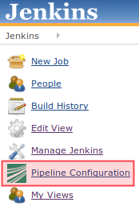

# Jenkins Guide (DETAILED)

This repository contains the code (config, src and script files) to set up and run a Cob-[Jenkins CI server](http://jenkins-ci.org) using the [Cob-Pipeline-Plugin](http://github.com/fmw-jk/cob-pipeline-plugin).

This guide is designed for Cob-Pipeline developers and those who want to know more about it. **If you want to set up Cob-Pipeline quickly and only use it, the [minimal Jenkins Guide](README.md) is what you are looking for.**
Below you will find a detailed description of the purposes of the Cob-Pipeline. A short description of the setup process can be found in the [minimal Jenkins Guide](README.md). Read this first. Further information are given below.

###Version
The plugin and this manual are developed and tested for Jenkins CI v1.514.

###Table of Contents
* [Software Structure](#software-structure)
* [Pipeline Structure](#pipeline-structure)
* [Installation and Setup](#installation-and-setup)
    * [Master](#master)
        * [Installation of software on Master node](#installation-of-software-on-master-node)
        * [Configure Jenkins](#configure-jenkins)
        * [Set up Cob-Pipeline specific configurations](#set-up-cob-pipeline-specific-configurations)
    * [Tarball Server](#tarball-server)
    * [Slaves](#slaves)
        * [Configure the node](#configure-the-node)
        * [Create a new slave node in Jenkins](#create-a-new-slave-node-in-jenkins-slave-setup-on-master)
    * [Manual Pipeline Generation (deprecated)](#manual-pipeline-generation-deprecated)


Software Structure
==================
For the usage of the Cob-Pipeline three parts are necessary:
* [Cob-Pipeline-Plugin](https://github.com/fmw-jk/cob-pipeline-plugin) for Jenkins<br/>
    This plugin allows the user to configure its individual build/test
    pipeline via the Jenkins web interface. Afterwards the automatic generation
    of the pipeline can be triggered.
* [jenkins\_setup repository](https://github.com/ipa320/jenkins_setup)<br/>
    This repository has to be available on the Jenkins server. It
    includes the code for the pipeline generation.
* [jenkins\_config
  repository](https://github.com/ipa320/jenkins_config)<br>
    In this repository all the pipeline configurations are stored.


Pipeline Structure
==================
The pipeline is made of multiple, differing Jenkins jobs which monitor
the source code or build and test it in various envirements.
An authorized Jenkins user can configure its individual pipeline in its
Jenkins user configurations. The made configurations have to pass a
validation and afterwards the automatic generation of the pipeline can
be started.

A fully configured pipeline has always the structure shown in the
picture below.


###Job Types
####Starter Jobs
* **Pipestarter Job**

####Build Jobs
* **Priority-Build Job**
* **Regular-Build Job**
* **Downstream-Build Job**

####Test Jobs
* **Non-Graphics-Test Job**
* **Graphics-Test Job**

####Hardware Jobs
* **Hardware-Build Job**
* **Hardware-Test Job**


**TODO**


Installation and Setup
======================
Description how to set up the Jenkins master and its slaves. This manual is made and tested for Ubuntu 12.04 Precise. Especially for older versions there might occur some problems.

Master:
-------

###Installation of software on Master node
####Install Jenkins CI
To install Jenkins follow the [official website](http://jenkins-ci.org/).
To add the official package source on Debian/Ubuntu follow
[this description](http://pkg.jenkins-ci.org/debian/).
After a successful installation you can access the Jenkins server in
your browser on \<YOUR_JENKINS_SERVER_IP\>:8080.

> #####Up-/Downgrade
> The Cob-Pipeline-Plugin is developed for Jenkins v1.514. If your version
> is older or newer, you can up-/downgrade to another
> one by [downloading the version](http://mirrors.jenkins-ci.org/war)
> you need into ```/user/share/jenkins/```. If you stored it with another
> name than jenkins.war, adapt the ```JENKINS_WAR``` environment variable
> in ```/etc/default/jenkins```. After a change, the automatic update is
> not possible anymore. ```JENKINS_WAR``` has to be set back to the default
> ```/user/share/jenkins/jenkins.war``` first.
> **After all restart the Jenkins server**.
```bash
/etc/init.d/jenkins restart
```

> *!!!In general: Be careful with updating your Jenkins server. If you do, check if
everything works still properly, especially the plugins!!!*

####Install Git:
```bash
apt-get install git
```

####Install ROS:
Install [groovy](http://www.ros.org/wiki/groovy/Installation/Ubuntu) or
[fuerte](http://www.ros.org/wiki/fuerte/Installation/Ubuntu) as described.

####Install and Setup an **apt-cacher** (optional):
During the later build process a lot packages will be installed. If
the build jobs run frequently, the network traffic increases quite
much. To limit the amount of packages to be downloaded from the
internet and speed up the installation process a apt-cacher is
pretty useful. You can for example use the
[apt-cacher-ng](http://www.unix-ag.uni-kl.de/~bloch/acng/).
To use the apt-cacher during the build process set up an apt-cacher and
edit the [install_basics.sh script](./scripts/install_basics.sh) as descripted
[here](./README.md#adapt-apt-cacher-address).

You can also use the apt-cacher of pbuilder. Then you should **NOT** do
[this](https://github.com/ipa320/jenkins_setup/blob/master/README.md#dont-use-pbuilders-aptcache).

###Installation of plugins in Jenkins
####Install required Jenkins plugins
Go to Jenkins plugin manager (\<YOUR_JENKINS_SERVER_IP\>:8080/pluginManager/available) and install the following plugins:
* **Parameterized Trigger Plugin** ([website](http://wiki.jenkins-ci.org/display/JENKINS/Parameterized+Trigger+Plugin))<br/>
    Is used to transfer build parameters from one job to the next.
    Here it is used to commit the repository to build or test.
* **Build Pipeline Plugin**
  ([website](http://code.google.com/p/build-pipeline-plugin))<br/>
    Provides a view where all pipeline jobs and their dependencies are
    shown. It also gives the opportunity to trigger the hardware test
    jobs manually.
* **Mailer** ([website](http://wiki.jenkins-ci.org/display/JENKINS/Mailer))<br/>
    Generates the email content depending on the build/test results
    and sends the emails.
* **View Job Filters**
  ([website](http://wiki.jenkins-ci.org/display/JENKINS/View+Job+Filters))<br/>
    Provides comprehensive possibilities to filter the jobs that can
    be seen by the specific user.

* **Matrix Reloaded Plugin**
  ([website](http://wiki.jenkins-ci.org/display/JENKINS/Matrix+Reloaded+Plugin))<br/>
    To start one or more entries of a matrix job.
* *LDAP Plugin* (not required but maybe useful)
  ([website](https://wiki.jenkins-ci.org/display/JENKINS/LDAP+Plugin))<br/>
    Authentication of users is delegated to a LDAP server.
* *Github OAuth Plugin* (not required but maybe useful)
  ([website](http://wiki.jenkins-ci.org/display/JENKINS/Github+OAuth+Plugin))<br/>
    Authentication of users is delegated to Github using the OAuth
    protocol.
* **TODO**

####Install the Cob-Pipeline Plugin
Download the plugin (\*.hpi file) from
[here](https://github.com/fmw-jk/cob-pipeline-plugin/releases) and place it
in ```<JENKINS_HOME>/plugins/```. After you restarted Jenkins
```/etc/init.d/jenkins restart```
the plugin should be available and the **Pipeline Configuration** link
should be present in the sidebar (see picture).



Configure Jenkins as described below before you use the plugin.

___

###Configure Jenkins
To manage your Jenkins server, go to
\<YOUR_JENKINS_SERVER_IP\>:8080/manage or follow "Manage Jenkins" in the sidebar.
From here you can configure everything.

####Configure Security
There are multiple ways to configure the global security of your Jenkins
server. First of all follow **Configure Global Security** and check **Enable Security**.

#####Security Realm
The **Access Control** section gives the opportunity to select the
**Security Realm** which defines how the users can login.

* **Jenkins's own user database**<br/>
    The easiest way is to use **Jenkins's own user database**. This option
    should always be available and possible. Now you can decide if every
    user can sign up or if the admin has to do this.

    If you use this, you have to create an user before you go on. This user will
    later on act as the admin user. Therefore save the configurations and
    **sign up** (upper right corner). Came back afterwards.

> * **LDAP**<br/>
>   If a LDAP server is available, you can use it as the user database.
>   Therefore the [LDAP Plugin](#install-required-jenkins-plugins) is required.
>   How to configure the LDAP access can be found on the [plugin's website]
>   (https://wiki.jenkins-ci.org/display/JENKINS/LDAP+Plugin).

> * **Github Authentication Plugin**<br/>
>   Another way is to use the GitHub user database for user identification.
>   The [Github OAuth Plugin](#install-required-jenkins-plugins) has to be
>   installed. Configure the plugin as described
>   [here](https://wiki.jenkins-ci.org/display/JENKINS/Github+OAuth+Plugin).

#####Authorization
In the **Authorization** subsection you can define the permission a specific
user or a user group gets granted. Therefore choose the
'Project-based Matrix Authorization Strategy'.

You have to give permissions to at least the *Anonymous* and the
*authenticated* user group and an *admin* user. The latter two have to be
added to the matrix.

> If you use [Jenkins's own user database](#jenkin's-own-user-database)
> the admin user you just created can be used. If one of the other
> [Security Realms](#security-realm) is used, take an existing user as
> admin.

**The *admin* should have all rights.** Otherwise you will
[lock out yourself](https://wiki.jenkins-ci.org/display/JENKINS/Disable+security).
This account will also be used to create the pipeline jobs
automatically.
The users and groups could get the permissions as shown below.


Every user will automatically get the permission to see the workspace of
all its own jobs. For the 'Pipestarter' and 'Trigger' job it will also has
'Build'-permission.
> If you want to grant further permissions or give special permissions to
> individual users or user groups you can do it here.


####Set up view
Create new view. **TODO**

####Configure Plugins
#####Basic configurations
######Jenkins Location
Enter here the URL of your Jenkins server and the admins email address.

#####Cob-Pipeline Plugin
Go to the ***Cob Pipeline Configuration*** section.
The following fields are all required for the use.
* **Jenkins Admin Login/Password**:<br/>
    This is the user you configured before in the [Configure Security
    part](https://github.com/ipa320/jenkins_setup/blob/master/README.md#configure-security)
    with all the permissions. Enter its login name and password.
* **Configuration Folder**:<br/>
    Enter the path of the [Cob-Pipeline configuration
    folder](https://github.com/ipa320/jenkins_setup/blob/master/README.md#cob-pipeline-configuration-folder).
* **Tarball Location**:<br/>
    Enter the [location where the tarballs are
    stored](https://github.com/ipa320/jenkins_setup/blob/master/README.md#tarball-server).
* **GitHub User Login/Password**:<br/>
    This is the user that has read-permission to all the repositories
    you want to be tested. It has also write-permission to your
    jenkins-config repository.
* **Pipeline Repositories Owner/Fork**:<br/>
    GitHub user that ownes the jenkins\_setup and the jenkins\_config
    repository.
* **ROS Releases**:<br/>
    ROS versions that should be supported by your build/test pipeline.
* **Robots**:<br/>
    Nodes which can be chosen for Hardware Build/Test jobs.
* **Target Platform Url**:<br/>
    URL where the ROS ```targets.yaml``` is stored, defining the Ubuntu
    target platforms for each ROS Version, [e.g.]
    (https://raw.github.com/ros/rosdistro/master/releases/targets.yaml).

When you fill out the fields, the values will be validated in the
background.

#####Mailer
######Default Subject
For example: ```$BUILD_STATUS: $PROJECT_NAME - Build # $BUILD_NUMBER!```
A complete list of tokens can be found at the help of the last entry
(Content Token Reference).
Do also [move the mailer template](#mailer-template) as described.

___

###Set up Cob-Pipeline specific configurations
####Cob-Pipeline configuration folder
All configurations should be stored in a common folder in the
`$HOME`-folder called `jenkins-config`:
```bash
mkdir ~/jenkins-config
```

####Git configurations
Set up the GitHub user. This user has to have read-access to all
repositories to build and write-access to your ```jenkins_config```
repository.
```bash
git config --global user.name "<USER_NAME>"
git config --global user.email "<EMAIL>"
```
**TODO** what is necessary?

####SSH configurations
A `.ssh`-folder is needed inside the ```~/jenkins-config/```-folder which contains a ssh-key to access the GitHub-repositories. Either you generate a new key with `ssh-keygen` or you just copy the `~/.ssh` of the master. You have to add this key to your GitHub user (http://github.com/settings/ssh). This user should have read-access to all repositories you want to build.
It is very important that 'github.com' belongs to the *known hosts*. Therefore the `.ssh`-folder should contain a ```known_hosts``` file. Whether 'github.com' is already known can be checked by entering:
```bash
ssh-keygen -H -f <known_hosts_PATH> -F github.com
```
If it is not known, you can add 'github.com' to the ```known_hosts``` by entering:
```bash
ssh-keyscan -H github.com > <known_hosts_PATH>
```

Furthermore the Jenkins masters SSH key itself has to be an authorized
one.

####jenkins\_config repository
Clone the ```jenkins_config``` repository into the `jenkins-config` folder:
```bash
git clone git@github.com:ipa320/jenkins_config.git ~/jenkins-config/jenkins_config
```
*!!!Adapt the GitHub user if you forked the repository!!!*
**TODO**

####jenkins\_setup repository
Clone the ```jenkins_setup``` repository into the `jenkins-config` folder:
```bash
git clone git@github.com:ipa320/jenkins_setup.git ~/jenkins-config/jenkins_setup
```
*!!!Adapt the GitHub user if you forked the repository!!!*

#####Adapt apt-cacher address
*If you use an apt-cacher* you have to enter its address in the
[install_basics.sh script](./scripts/install_basics.sh). Adapt the
APT_PROXY_ADDRESS variable to your requirements.
```bash
echo "\n***APT-PROXY***"
APT_PROXY_ADDRESS="http://cob-jenkins-server:3142"
sh -c 'echo "Acquire::http { Proxy \"'$APT_PROXY_ADDRESS'\"; };" > /etc/apt/apt.conf.d/01proxy'
```

#####PYTHONPATH
Add the ```jenkins_setup``` module to the `$PYTHONPATH` (*adapt the
ROS\_RELEASE*):
```bash
sudo su -c 'echo "export PYTHONPATH=~/jenkins-config/jenkins_setup/src" > /etc/profile.d/python_path.sh'
sudo su -c 'echo "source /opt/ros/<ROS_RELEASE>/setup.sh" >> /etc/profile.d/python_path.sh'
```
Afterwards reboot the server.

####Mailer template
A
[template](templates/email-templates/html-with-health-builds-tests.jelly) for the
Mailer plugin is provided in this repository. Copy it into
```$JENKINS_HOME/email-templates/``` (```$JENKINS_HOME``` is usually `/var/lib/jenkins`).
You can adapt the template to your requirements.
**TODO** jenkins config

___

Tarball Server:
---------------
The tarball server stores all the chroot tarball which will be used during the build
process. It can be the Jenkins master or another server. In both cases you have to
create a ```chroot_tarballs```-folder in `$HOME` which contains another folder where
the used chroot tarballs will be stored:
```bash
mkdir -p ~/chroot_tarballs/in_use_on__<JENKINS_MASTER_NAME>
```

___

Slaves:
-------
###Configure the node

####Sudo commands without password on slave
To be able to run sudo commands without the need to enter the password each time, enter
```sudo visudo``` and add
```conf
<JENKINS-USER>    ALL=(ALL) NOPASSWD: ALL
```
at the end. Exit with `CTRL-X`. After re-login you won't need a password anymore.

####SSH access without password to master (and the otherway around)
The slave has to be able the access the master via SSH without a password (and the
otherway around). Enter the following command on each slave, login to the master and
run the command again.
```bash
ssh-copy-id <master>    # on slave
ssh <master>            # on slave
ssh-copy-id <slave>     # on master
```
Go back with twice `CTRL-D`.

####Pbuilder
Pbuilder is required! If not present, install it:
```bash
apt-get install pbuilder devscripts
```

#####Performance improvement
For the configurations a file called `~/.pbuilderrc` in the slaves `$HOME`-folder is
needed (`/etc/pbuilder/pbuilderrc` is an alternative).

######Don't use pbuilders aptcache
The aptcach of pbuilder is very useful but when the cache is getting
bigger gradually it takes quite a while to open a chroot from the
tarball. If you don't want to use it (for instance if you use an
external apt-cacher), add the following to
`~/.pbuilderrc`:
```conf
# don't use aptcache
APTCACHE=""
```

######Use ccache for build
To use ccache inside the pbuilder add the following to `~/.pbuilderrc`:
```conf
# ccache
sudo mkdir -p /var/cache/pbuilder/ccache
sudo chmod a+w /var/cache/pbuilder/ccache
export CCACHE_DIR="/var/cache/pbuilder/ccache"
export PATH="/usr/lib/ccache:${PATH}"
EXTRAPACKAGES=ccache
BINDMOUNTS="${CCACHE_DIR}"
```


######Use multi-core zipping
To speedup the zipping and unzipping of the chroot tarballs, install `pigz`:
```bash
apt-get install pigz
```

And add the following to .pbuilderrc:
```conf
# pigz; multicore zipping
COMPRESSPROG=pigz
```

######Mount memory to run the pbuilder chroots in it
Installations and builds inside the chroot need quite a lot write accesses. If you don't have a SSD installed, you can use the memory for this. Therefore you have to create a filesystem in your RAM, using `tmpfs` by adding the following to the slaves `/etc/fstab`:
```conf
# pbuilder
tmpfs   /var/cache/pbuilder/build   tmpfs   defaults,size=32000M    0   0
```

*The size depends on the size of the chroot you will work with (at least 3G, more is better). It can be larger then the RAM size. If the chroot size exceeds the RAM size it will use the SWAP as well.*

Additionally you have to add the following to `~/pbuilderrc`:
```conf
# tmpfs
APTCACHEHARDLINK=no
```

Finally mount `tmpfs` by entering **(as root)**:
```bash
mount -a
```

###Create a new slave node in Jenkins (Slave setup on master)
**TODO**
* Labels
* Configurations
* Connect slave
* Troubleshooting

**TODO**
* github.com to known_hosts<br/>
    If a git repository is cloned during the job build, github.com has
    to be a known\_host on each slave the job runs.
* upload ssh key<br/>
    Furthermore has the public SSH-key of every slave to be uploaded to
    the authorized GitHub-account.
___


Manual Pipeline Generation (deprecated):
===========================

1. Checkout this repository:
----------------------------

Clone this repository to your desired location
```bash
git clone git://github.com/ipa320/jenkins_setup.git <path to clone in>
```


2. Set up slave config file:
----------------------------

Create a folder in your HOME-folder called: jenkins-config
```bash
mkdir ~/jenkins-config
```

Create a so called slave_config.yaml file with the following entries:
```yaml
master: name_of_jenkins_master
master_uri: "http://url_of_jenkins_master:8080"
tarball_host: name_of_server_storing_the_chroot_tarballs
tarball_folderpath: folder_the_tarballs_are_stored
jenkins_login: user_name_with_right_to_create_jobs
jenkins_pw: user_password
```

3. Add repository to PYTHONPATH:
--------------------------------

```bash
export PYTHONPATH=$PYTHONPATH:<repository_path>/src
```

4. Set up pipeline configuration:
---------------------------------

Checkout the repository [jenkins_config](https://github.com/ipa320/jenkins_config "ipa320/jenkins_config")
```bash
git clone git@github.com:config/jenkins_config.git
```

Repository structure:
```bash
jenkins_config
|-jenkins_master_name1
| |- user_name1
| |  |-pipeline_config.yaml
| |- user_name2
| |  |-pipeline_config.yaml
|-jenkins_master_name2
| |- user_name3
| |  |-pipeline_config.yaml
```

You have to create a folder according to your Jenkins masters name (if
not existent yet). Inside create a folder with your user name. Within this
folder set up a pipeline_config.yaml file with your configurations. You
can use the \<jenkins_config_repository_location\>/jenkins-test-server/test-user
as an example.

When your done push it to GitHub.

5. Create pipeline:
-------------------

Execute the
\<jenkins_setup_repository_location\>/scripts/generate_buildpipeline.py
script to create all your pipeline jobs on the Jenkins CI Server.

```bash
./generate_buildpipeline.py <user_name>
```
